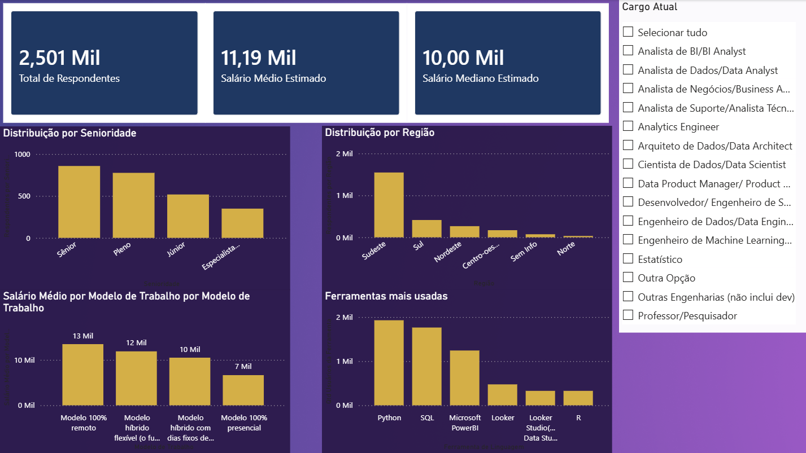
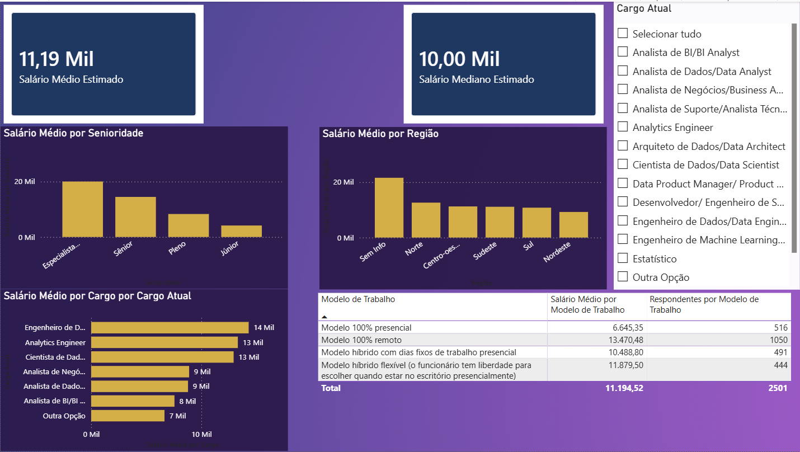
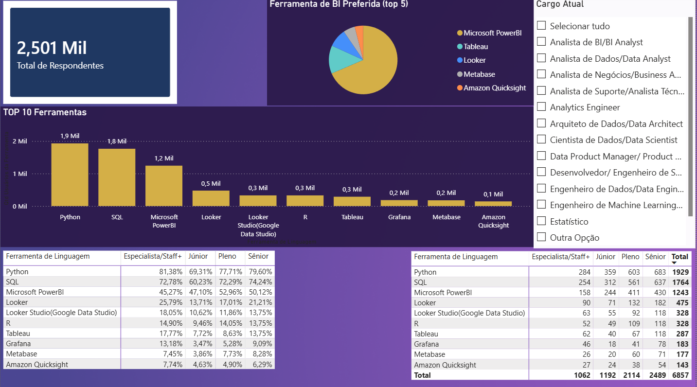
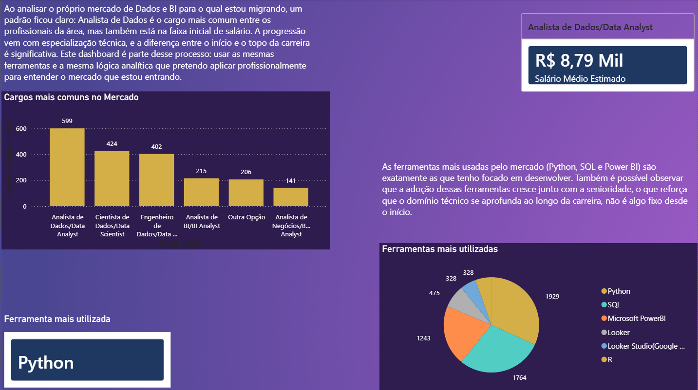

# Dashboard de Mercado de Dados e BI no Brasil (Power BI)

Dashboard interativo desenvolvido em Power BI para analisar o mercado de trabalho em Dados e BI no Brasil, com base na pesquisa State of Data Brazil 2025-2026 (Data Hackers em parceria com a Bain & Company).

---

# Objetivo

Aplicar modelagem de dados, Power Query e DAX (medidas com `CALCULATE`, `ALLEXCEPT`, `AVERAGEX`, `MEDIANX` e `DIVIDE`) sobre uma pesquisa real do setor de Dados e BI, construindo um dashboard que analisa salários, ferramentas e perfil dos profissionais da área para a qual estou migrando.

---

## Tecnologias Utilizadas

| Ferramenta | Uso |
|---|---|
| Power BI Desktop | Modelagem, DAX e construção do dashboard |
| Power Query | Limpeza, transformação e modelagem dos dados |

---

# Fonte e Obtenção dos Dados

Os dados utilizados não estão incluídos neste repositório (dataset de terceiros, disponível publicamente no Kaggle).

1. Baixe o dataset original em: [State of Data Brazil 2025-2026 — Kaggle](https://www.kaggle.com/datasets/datahackers/state-of-data-brazil-2025-2026)
2. Abra o arquivo `.pbix` no Power BI Desktop e aponte a fonte de dados para o CSV baixado

A pesquisa contém **3.495 respondentes** no total. Após filtragem para profissionais atualmente empregados na área (removendo registros sem cargo, senioridade ou faixa salarial preenchidos), a análise considera **2.501 registros**.

---

# Estrutura do Projeto

dashboard-mercado-dados-bi-powerbi/
│
├── dashboard_mercado_dados_bi.pbix
├── screenshots/
│ ├── 01-visao-geral.png
│ ├── 02-salarios.png
│ ├── 03-ferramentas.png
│ └── 04-insight-pessoal.png
└── README.md

---

# Páginas do Dashboard

## 1. Visão Geral

Panorama geral do mercado: total de respondentes, salário médio e mediano, distribuição por senioridade e região, salário por modelo de trabalho e ranking de ferramentas mais usadas.

## 2. Salários

Análise salarial segmentada por senioridade, cargo (top 10), região e modelo de trabalho.

## 3. Ferramentas e Stack

Ranking de ferramentas e linguagens mais usadas, cruzamento de adoção por senioridade e ranking de ferramentas de BI preferidas.

## 4. Insight Pessoal

Conexão entre os dados analisados e minha própria transição de carreira para a área.

---

# Principais Análises e Insights

## 1. Progressão salarial por senioridade

O salário médio cresce de forma consistente com a senioridade: R$ 4.152 (Júnior) para R$ 14.469 (Sênior), chegando a R$ 20.028 em posições de Especialista/Staff+.

## 2. Cargo mais comum não é o mais bem pago

Analista de Dados é o cargo com mais respondentes (599 de 2.501), mas está na faixa inicial de salário. Cargos como Arquiteto de Dados e ML Engineer, mais raros, concentram os maiores salários médios.

## 3. Trabalho remoto paga significativamente mais

O salário médio de quem trabalha 100% remoto (R$ 13.470) é quase o dobro do modelo 100% presencial (R$ 6.645).

## 4. Adoção de ferramentas cresce com a senioridade

Python e SQL, as ferramentas mais usadas do mercado, têm adoção crescente por senioridade (Python: 69% entre Júniores, 80% entre Sêniores), indicando aprofundamento técnico contínuo ao longo da carreira.

## 5. Microsoft Power BI lidera as preferências de BI

Entre quem tem uma ferramenta de BI preferida, o Power BI domina com ampla margem sobre Tableau, Looker e demais concorrentes.

---

# Autor

**Alan Barion de Sá**
Analista de Dados Júnior | Business Intelligence | Dados Financeiros
📧 alanbarion@gmail.com 🔗 [LinkedIn](https://linkedin.com/in/alan-barion-de-sá-674a69284) 🐙 [GitHub](https://github.com/alanbarion)

---

# Data and BI Job Market Dashboard in Brazil (Power BI)

Interactive Power BI dashboard analyzing the Data and BI job market in Brazil, based on the State of Data Brazil 2025-2026 survey (Data Hackers in partnership with Bain & Company).

---

# Objective

Apply data modeling, Power Query and DAX (measures using `CALCULATE`, `ALLEXCEPT`, `AVERAGEX`, `MEDIANX` and `DIVIDE`) to a real survey from the Data and BI industry, building a dashboard that analyzes salaries, tools and the profile of professionals in the field I am transitioning into.

---

## Tools Used

| Tool | Use |
|---|---|
| Power BI Desktop | Data modeling, DAX and dashboard design |
| Power Query | Data cleaning, transformation and modeling |

---

# Data Source

The data used is not included in this repository (third-party dataset, publicly available on Kaggle).

1. Download the original dataset at: [State of Data Brazil 2025-2026 — Kaggle](https://www.kaggle.com/datasets/datahackers/state-of-data-brazil-2025-2026)
2. Open the `.pbix` file in Power BI Desktop and point the data source to the downloaded CSV

The survey contains **3,495 respondents** in total. After filtering for professionals currently employed in the field (removing records with missing role, seniority or salary range), the analysis considers **2,501 records**.

---

# Project Structure

dashboard-mercado-dados-bi-powerbi/
│
├── dashboard_mercado_dados_bi.pbix
├── screenshots/
│   ├── 01-visao-geral.png
│   ├── 02-salarios.png
│   ├── 03-ferramentas.png
│   └── 04-insight-pessoal.png
└── README.md

---

# Dashboard Pages

## 1. Overview

General market overview: total respondents, average and median estimated salary, distribution by seniority and region, average salary by work model, and ranking of most used tools.

## 2. Salaries

Salary analysis segmented by seniority, role (top 10), region and work model.

## 3. Tools and Stack

Ranking of most used tools and languages, adoption by seniority, and ranking of preferred BI tools.

## 4. Personal Insight

Connecting the analyzed data to my own career transition into the field.

---

# Key Findings

## 1. Salary progression by seniority

Average salary grows consistently with seniority: R$ 4,152 (Junior) to R$ 14,469 (Senior), reaching R$ 20,028 for Specialist/Staff+ roles.

## 2. The most common role is not the highest paid

Data Analyst is the role with the most respondents (599 of 2,501), but sits at the entry level salary range. Rarer roles such as Data Architect and ML Engineer concentrate the highest average salaries.

## 3. Remote work pays significantly more

The average salary of fully remote workers (R$ 13,470) is nearly double that of fully in office workers (R$ 6,645).

## 4. Tool adoption grows with seniority

Python and SQL, the most used tools in the market, show increasing adoption by seniority (Python: 69% among Juniors, 80% among Seniors), indicating continuous technical depth throughout a career.

## 5. Microsoft Power BI leads BI tool preference

Among those with a preferred BI tool, Power BI leads by a wide margin over Tableau, Looker and other competitors.

---

# Author

**Alan Barion de Sá**
Junior Data Analyst | Business Intelligence | Financial Data
📧 alanbarion@gmail.com 🔗 [LinkedIn](https://linkedin.com/in/alan-barion-de-sá-674a69284) 🐙 [GitHub](https://github.com/alanbarion)
